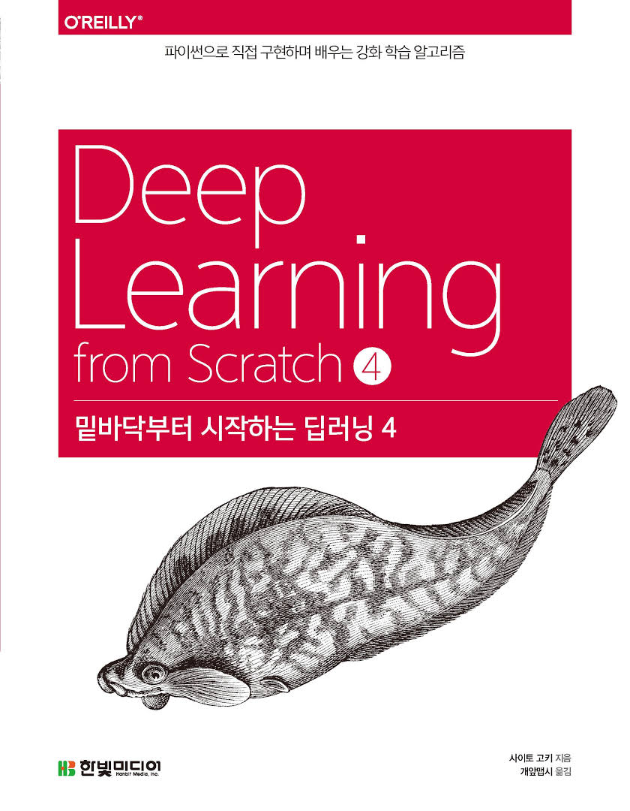

  

# 📖 밑바닥부터 시작하는 딥러닝 5
본 레포지토리는 『밑바닥부터 시작하는 딥러닝 4』를 공부하기 위해 제작되었다. 『밑바닥부터 시작하는 딥러닝 4』는 강화 학습을 다루는 책으로 강화 학습의 기초부터 심층 강화 학습 알고리즘까지 폭넓은 내용을 담고 있다. 본 레포지토리는 도서에서 제공하는 예제 코드를 정리해 두었으며, 각 내용을 함축적으로 정리한 개인 학습 메모도 함께 포함되어 있다.